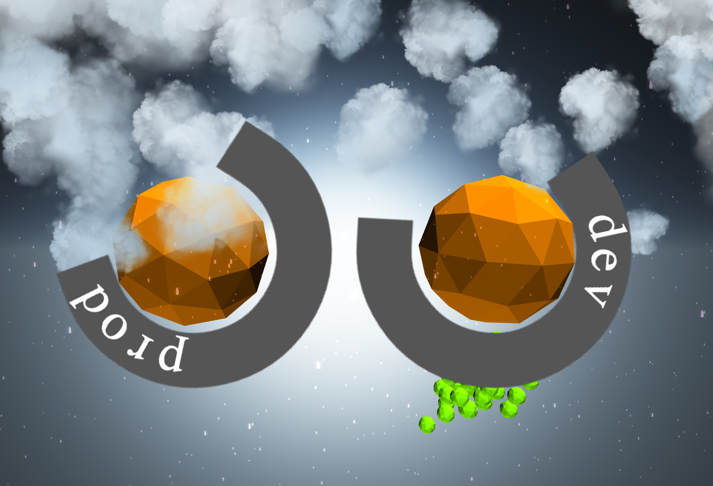
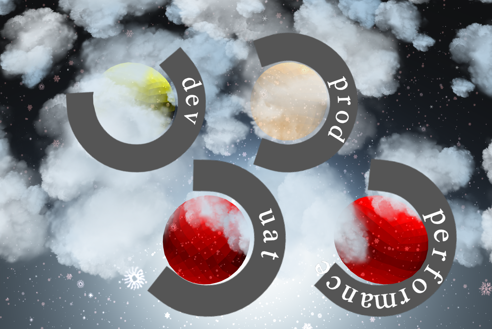
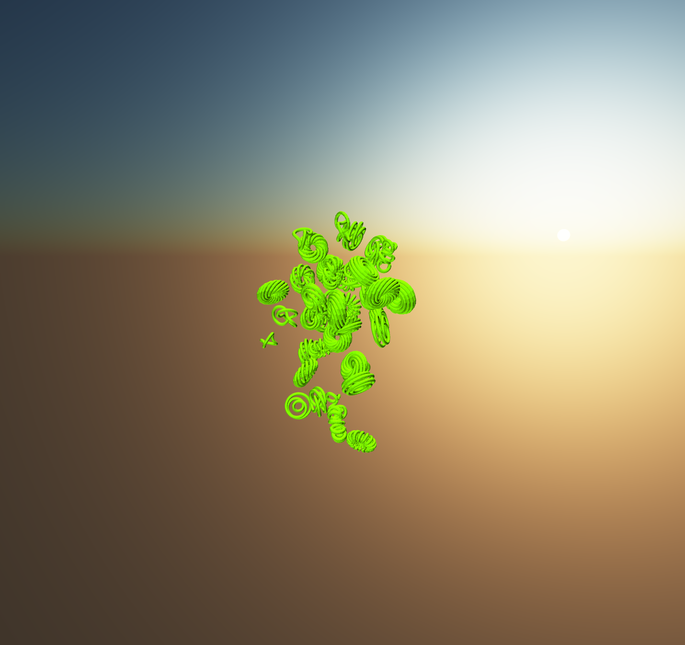

# abyss

A 3D build radiator worth looking at.

Build radiators needs to be fun. Anyone can develop plain old html/css grid based view.
That stuff is like flash, old and needs to be replaced.

Put this on your TV, and you will never go back to any other build radiator.

### Screenshots - That do not do justice





### Supported CI Servers

Thanks to [clj-cctray](https://github.com/build-canaries/clj-cctray)

	1.  GO
	2.  Jenkins
	3.  Hudson
	4.  Travis
	5.  Circle
	6.  Team City

### Starting the app using jar
	1. Download the standalone jar from releases.
	2. ```java - jar abyss-1.0.0-standalone.jar```

### Starting the app using docker
Sample [Dockerfile](https://github.com/sanagrwl/abyss/blob/master/Dockerfile)

	1. Build the app using `lein ring uberjar` or download the standalone jar in `target` directory. 
	2. docker build -t abyss:latest .

### Starting the app use code

	1. lein ring server
	2. launch browser at <hostname>:3000

	Since the config is UI based, different teams have full control over their configuration. 

### Sounds

Sounds are played on 2 different events.

	1. When the build breaks.
	2. When the build succeeds after breaking.

To have your custom sounds available:

	1. Copy your audio file(s) in `sounds` folder or provide `-DsoundsDir=<path-to-sounds-dir>`. No need to restart the server.
	2. Reload the page.
	3. Select audio in controls.

You always have the ability to switch on/off either or both sounds.

### Ball Colors

1. Green is healthy.
2. Yellow is building.
3. Red is broken.
4. Orange is building after being Red.

### Shapes

You can select one of the following shapes or let the app select one randomly.

	ball, icosahedron, torus, cylinder, cone, coil, tetrahedron, octahedron or random

### Weather

The monitor displays weather conditions based on the status of your builds.

	sunny, cloudy, rainy, snow, blizzard

### Events
People sometimes prefer to have sounds switched off.
These events are meant to attract your attention to broken builds visually.

1. Red alert (if 5 or more broken builds, configurable).
2. Glitch effect (if 6 or more broken builds, configurable).

### UI Controls
	- Sound selection when build goes Red.
	- Sound selection when build goes from Orange to Green.
	- Custom Shapes
	- Toggle text rotation.
	- Attraction/Repulsion for all the green abyss.
	- Custom thresholds for events.
	- Custom colors. (to be implemented).

### Known issues

1. If webgl is not supported by browser/machine, it will not work.
   Use [nevergreen](https://github.com/build-canaries/nevergreen).

2. Local storage is required to save your config and UI controls.

3. Performance may vary based on computer you use.

### License

Distributed under the Eclipse Public License.
